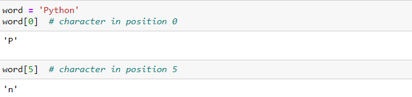

> Pembahasan Pertemuan Minggu - 1

# Instalasi dan Penggunaan Interpreter Python

## BAB 1 | **Overview tentang Python** 

Phyton adalah bahasa pemrograman yang bersifat interpreted karena program – program Phyton dapat langsung di eksekusi oleh interpreted tanpa harus melalui tahap kompilasi, dalam artian tidak tercompile secara sempurna dan mudah dibawa ataupun diedit kembali, kemudian penggunaan Decision atau pemilihan kondisi pada bahasa phyton terdiri atas IF, IF Bersarang, ELIF ataupun ELSE. Python juga merupakan High Programming Language atau bahasa tingkat tinggi, artinya instruksi-intruksi yang ada di dalamnya sudah mendekati bahasa manusia.

## BAB 2 | **Penggunaan Interpreter Python** 

### 2.1. **Memanggil Penerjemah**  

Penerjemah Python biasanya diinstal seperti

> /usr/local/bin/python3.10

pada mesin yang tersedia; memasukkan /usr/local/binjalur pencarian shell Unix Anda memungkinkan untuk memulainya dengan mengetikkan perintah:

> python3.10

ke shell / command prompt. Karena pilihan direktori tempat tinggal juru bahasa adalah pilihan instalasi, tempat lain dimungkinkan; tanyakan kepada guru Python atau administrator sistem lokal Anda. (Misalnya, /usr/local/pythonadalah lokasi alternatif yang populer.)

Pada mesin Windows di mana Anda telah menginstal Python dari Microsoft Store , python3.10perintah akan tersedia. Jika Anda menginstal peluncur py.exe , Anda dapat menggunakan pyperintah. Lihat Excursus: Mengatur variabel lingkungan untuk cara lain meluncurkan Python.

Mengetik karakter akhir file ( pada Unix, pada Windows) pada prompt utama menyebabkan juru bahasa keluar dengan status keluar nol. Jika tidak berhasil, Anda dapat keluar dari juru bahasa dengan mengetikkan perintah berikut: .Control-DControl-Zquit()

Fitur penyuntingan baris penerjemah mencakup penyuntingan interaktif, penggantian riwayat dan penyelesaian kode pada sistem yang mendukung pustaka GNU Readline . Mungkin pemeriksaan tercepat untuk melihat apakah pengeditan baris perintah didukung adalah mengetik ke prompt Python pertama yang Anda dapatkan. Jika berbunyi bip, Anda memiliki pengeditan baris perintah; lihat Lampiran Pengeditan Input Interaktif dan Substitusi Riwayat untuk pengenalan kunci. Jika tidak ada yang terjadi, atau jika digemakan, pengeditan baris perintah tidak tersedia; Anda hanya dapat menggunakan backspace untuk menghapus karakter dari baris saat ini.Control-P^P

Interpreter beroperasi seperti shell Unix: ketika dipanggil dengan input standar yang terhubung ke perangkat tty, ia membaca dan mengeksekusi perintah secara interaktif; ketika dipanggil dengan argumen nama file atau dengan file sebagai input standar, ia membaca dan mengeksekusi skrip dari file itu.

2. 1.1. **Mengoper Argumen**  
   Saat diketahui oleh penerjemah, nama skrip dan argumen tambahan setelahnya diubah menjadi daftar string dan ditetapkan ke argvvariabel dalam sysmodul. Anda dapat mengakses daftar ini dengan menjalankan . Panjang daftar setidaknya satu; ketika tidak ada skrip dan tidak ada argumen yang diberikan, adalah string kosong. Ketika nama skrip diberikan sebagai (artinya input standar), disetel ke . Saat perintah digunakan, disetel ke . Saat modul digunakan, disetel ke nama lengkap modul yang terletak. Opsi yang ditemukan setelah perintah atau modul tidak digunakan oleh pemrosesan opsi juru bahasa Python tetapi dibiarkan diimport syssys.argv[0]'-'sys.argv[0]'-'-c sys.argv[0]'-c'-m sys.argv[0]-c -m sys.argvuntuk ditangani oleh perintah atau modul.

    
   2.1.2. **Mode Interaktif**  
   Ketika perintah dibaca dari tty, interpreter dikatakan dalam mode interaktif . Dalam mode ini ia meminta perintah berikutnya dengan prompt utama , biasanya tiga tanda lebih besar dari ( >>>); untuk baris lanjutan ia meminta dengan prompt sekunder , secara default tiga titik ( ...). Penerjemah mencetak pesan selamat datang yang menyatakan nomor versi dan pemberitahuan hak cipta sebelum mencetak perintah pertama: 

     
   Garis lanjutan diperlukan saat memasuki konstruksi multi-baris. Sebagai contoh, lihat pernyataan if ini: 

     

### 2.2. **Lingkungan Interpreter**  

2. 2.1.**Sumber Kode Enkoding** 
   Secara default, file sumber Python diperlakukan sebagai dikodekan dalam UTF-8. Dalam pengkodean itu, karakter sebagian besar bahasa di dunia dapat digunakan secara bersamaan dalam literal string, pengidentifikasi, dan komentar — meskipun pustaka standar hanya menggunakan karakter ASCII untuk pengidentifikasi, sebuah konvensi yang harus diikuti oleh kode portabel apa pun. Untuk menampilkan semua karakter ini dengan benar, editor Anda harus mengenali bahwa file tersebut adalah UTF-8, dan harus menggunakan font yang mendukung semua karakter dalam file. 
   Untuk mendeklarasikan pengkodean selain yang default, baris komentar khusus harus ditambahkan sebagai baris pertama file. Sintaksnya adalah sebagai berikut:

   > | # -_- coding: encoding -_-

   di mana pengkodean adalah salah satu yang valid codecsdidukung oleh Python. 
   Misalnya, untuk menyatakan bahwa pengkodean Windows-1252 akan digunakan, baris pertama file kode sumber Anda harus:

   > | # -_- coding: cp1252 -_-

   Satu pengecualian untuk aturan baris pertama adalah ketika kode sumber dimulai dengan baris UNIX “shebang” . Dalam hal ini, deklarasi penyandian harus ditambahkan sebagai baris kedua file. Sebagai contoh:

   > | #!/usr/bin/env python3  
   > | # -_- coding: cp1252 -_-

## BAB 3 | **Pengenalan Informal Tentang Python** 

Pada contoh berikut, input dan output dibedakan dengan ada atau tidaknya prompt ( >>> dan … ): untuk mengulang contoh, Anda harus mengetikkan semuanya setelah prompt, ketika prompt muncul; baris yang tidak dimulai dengan prompt adalah output dari interpreter. Perhatikan bahwa perintah sekunder pada baris dengan sendirinya dalam contoh berarti Anda harus mengetikkan baris kosong; ini digunakan untuk mengakhiri perintah multi-baris.

Anda dapat mengaktifkan tampilan prompt dan output dengan mengklik >>>di sudut kanan atas kotak contoh. Jika Anda menyembunyikan perintah dan output sebagai contoh, maka Anda dapat dengan mudah menyalin dan menempelkan baris input ke penerjemah Anda.

Banyak contoh dalam manual ini, bahkan yang dimasukkan pada prompt interaktif, termasuk komentar. Komentar dalam Python dimulai dengan karakter hash, #, dan diperpanjang hingga akhir baris fisik. Sebuah komentar mungkin muncul di awal baris atau setelah spasi atau kode, tetapi tidak dalam literal string. Karakter hash dalam string literal hanyalah karakter hash. Karena komentar adalah untuk memperjelas kode dan tidak ditafsirkan oleh Python, komentar tersebut dapat dihilangkan saat mengetikkan contoh.

Beberapa contoh:

  
Disini ketika sebuah string diberi tanda pagar diawalannya, maka tidak akan terhitung sebagai string dan hanya akan menjadi komentar. biasanya ini digunakan untuk menjelaskan suatu kodingan. 

### 3.1 **Menggunakan Python Sebagai Kalkulator**

3. 1.1 **Angka**
     
   ini merupakan contoh proses matematika seperti layaknya sebuah kalkulator. pada setiap pembagian pasti akan menghasilkan output floating (desimal).  
    
     
   disini sama seperti yang telah dijelaskan sebelumnya, sebuah pembagian sederhana juga akan menghasilkan nilai desimal. Tetapi pembagian dengan floor akan menghilangkan nilai desimal. Sedangkan operator " % " mengembalikan sisa pembagian  
    
     
   Operator ** akan memberikan efek pangkat pada suatu angka jadi 5 ** 2 sama dengan 5 pangkat 2 alias 5x5 sama dengan 25. sama dengan 2 pangkat 7 sama dengan 128.  
    
     
   disini tanda sama dengan ( = ) digunakan untuk memberikan nilai pada variabel.  
    
     
   disini dapat dilihat bahwa n akan dicoba untuk di akses akan tetapi belum di defenisikan variabelnya, sehingga terjadi error.  
    
     
   ini masih seperti sebelumnya menggunakan nilai floating(desimal atau ada nilai dibelakang koma).  
    
     
   Dalam mode interaktif, ekspresi tercetak terakhir ditetapkan ke variabel \_. Ini berarti bahwa ketika Anda menggunakan Python sebagai kalkulator meja, akan lebih mudah untuk melanjutkan perhitungan. Variabel ini harus diperlakukan sebagai hanya-baca oleh pengguna. Jangan secara eksplisit menetapkan nilai padanya — Anda akan membuat variabel lokal independen dengan nama yang sama menutupi variabel bawaan dengan perilaku ajaibnya. Selain int dan float, Python mendukung jenis angka lain, seperti Decimaldan Fraction. Python juga memiliki dukungan bawaan untuk bilangan kompleks , dan menggunakan akhiran jor Juntuk menunjukkan bagian imajiner (misalnya 3+5j).  

3.1.2 **String**  
Selain angka, Python juga dapat memanipulasi string, yang dapat diekspresikan dalam beberapa cara. Mereka dapat diapit oleh tanda kutip tunggal ( '...') atau tanda kutip ganda ( "...") dengan hasil yang sama. 
dapat digunakan untuk menghindari kutipan: 
 
  
ada single quotes, ada untuk menghindari single quotes, atau pakai double quotes saja. 

 
  
Fungsi ini print()menghasilkan keluaran yang lebih mudah dibaca, dengan menghilangkan tanda kutip terlampir dan dengan mencetak karakter khusus dan karakter khusus:.  
 
  
Jika Anda tidak ingin karakter yang diawali dengan \ditafsirkan sebagai karakter khusus, Anda dapat menggunakan string mentah dengan menambahkan rsebelum kutipan pertama.  
 
  
String literal dapat menjangkau beberapa baris. Salah satu caranya adalah menggunakan tanda kutip tiga: """..."""atau '''...'''. Akhir baris secara otomatis disertakan dalam string, tetapi Anda dapat mencegahnya dengan menambahkan a \di akhir baris. menghasilkan output berikut (perhatikan bahwa baris baru awal tidak termasuk)  
 
  
String dapat digabungkan (direkatkan) dengan +operator, dan diulang dengan \*.  
 
  
Dua atau lebih literal string (yaitu yang terlampir di antara tanda kutip) di samping satu sama lain secara otomatis digabungkan.  
 
  
Fitur ini sangat berguna ketika Anda ingin memutuskan senar yang panjang.  
 
  
Ini hanya berfungsi dengan dua literal, tidak dengan variabel atau ekspresi.  
 
  
Jika Anda ingin menggabungkan variabel atau variabel dan literal, gunakan +.  
 
  
String dapat diindeks (berlangganan), dengan karakter pertama memiliki indeks 0. Tidak ada tipe karakter terpisah; karakter hanyalah string ukuran satu.  
 
  
Indeks juga bisa berupa angka negatif, untuk mulai menghitung dari kanan.  
 
  
Perhatikan bahwa karena -0 sama dengan 0, indeks negatif dimulai dari -1.

Selain pengindeksan, pengirisan juga didukung. Sementara pengindeksan digunakan untuk mendapatkan karakter individu, slicing memungkinkan Anda untuk mendapatkan substring.  
 
  
Indeks irisan memiliki default yang berguna; indeks pertama yang dihilangkan defaultnya adalah nol, indeks kedua yang dihilangkan defaultnya adalah ukuran string yang diiris.  
 
  
Perhatikan bagaimana awal selalu disertakan, dan akhir selalu dikecualikan. Ini memastikan bahwa selalu sama dengan :s[:i] + s[i:]s.  
 
  
Salah satu cara untuk mengingat cara kerja irisan adalah dengan menganggap indeks sebagai penunjuk antar karakter, dengan tepi kiri karakter pertama bernomor 0. Kemudian tepi kanan karakter terakhir dari string n karakter memiliki indeks n.  
 
  
Baris pertama angka memberikan posisi indeks 0…6 dalam string; baris kedua memberikan indeks negatif yang sesuai. Irisan dari i ke j terdiri dari semua karakter antara tepi berlabel i dan j , masing-masing.

Untuk indeks non-negatif, panjang irisan adalah selisih indeks, jika keduanya berada dalam batas. Misal panjangnya word[1:3]adalah 2.

Mencoba menggunakan indeks yang terlalu besar akan menghasilkan kesalahan.  
 
  
Namun, indeks irisan di luar jangkauan ditangani dengan anggun saat digunakan untuk mengiris.  
 
  
String Python tidak dapat diubah — mereka tidak dapat diubah . Oleh karena itu, menetapkan ke posisi yang diindeks dalam string menghasilkan kesalahan.  
 
  
Jika Anda membutuhkan string yang berbeda, Anda harus membuat yang baru.  
 
  
Fungsi len()bawaan mengembalikan panjang string.  

### 3.1.3 **Daftar/List**  

Python mengetahui sejumlah tipe data gabungan , yang digunakan untuk mengelompokkan nilai-nilai lain. Yang paling serbaguna adalah list , yang dapat ditulis sebagai daftar nilai (item) yang dipisahkan koma di antara tanda kurung siku. Daftar mungkin berisi item dari jenis yang berbeda, tetapi biasanya semua item memiliki jenis yang sama. 
 
  
Seperti string (dan semua jenis urutan bawaan lainnya), daftar dapat diindeks dan diiris.  
 
  
Semua operasi irisan mengembalikan daftar baru yang berisi elemen yang diminta. Ini berarti bahwa irisan berikut mengembalikan salinan daftar yang dangkal.  
 
  
Daftar juga mendukung operasi seperti penggabungan.  
 
  
Tidak seperti string, yang tidak dapat diubah , daftar adalah jenis yang dapat diubah , yaitu kontennya dapat diubah.  
 
  
Anda juga dapat menambahkan item baru di akhir daftar, dengan menggunakan append() metode (kita akan melihat lebih banyak tentang metode nanti).  
 
  
Penetapan irisan juga dimungkinkan, dan ini bahkan dapat mengubah ukuran daftar atau menghapusnya seluruhnya.  
 
  
Fungsi len()bawaan juga berlaku untuk daftar.  
 
  
Dimungkinkan untuk membuat daftar bersarang (membuat daftar yang berisi daftar lain), misalnya.  
 
  

### 3.2. **Langkah Awal Menuju Pemrograman**

 
Tentu saja, kita dapat menggunakan Python untuk tugas yang lebih rumit daripada menambahkan dua dan dua secara bersamaan. Misalnya, kita dapat menulis sub-urutan awal dari deret Fibonacci sebagai berikut:
 

  
Contoh ini memperkenalkan beberapa fitur baru.

- Baris pertama berisi beberapa penugasan : variabel adan bsecara bersamaan mendapatkan nilai baru 0 dan 1. Pada baris terakhir ini digunakan lagi, menunjukkan bahwa ekspresi di sisi kanan semuanya dievaluasi terlebih dahulu sebelum penugasan dilakukan . Ekspresi sisi kanan dievaluasi dari kiri ke kanan.

- Loop while dijalankan selama kondisi (di sini: ) tetap benar. Dalam Python, seperti di C, semua nilai integer bukan nol adalah benar; nol salah. Kondisi juga dapat berupa string atau nilai daftar, bahkan urutan apa pun; apa pun dengan panjang bukan nol adalah benar, urutan kosong adalah salah. Tes yang digunakan dalam contoh adalah perbandingan sederhana. Operator pembanding standar ditulis sama seperti pada C: (kurang dari), (lebih besar dari), (sama dengan), (kurang dari atau sama dengan), (lebih besar atau sama dengan) dan (tidak sama dengan).a < 10<>==<=>=!=

- Tubuh loop diindentasi : indentasi adalah cara Python mengelompokkan pernyataan. Pada prompt interaktif, Anda harus mengetikkan tab atau spasi untuk setiap baris indentasi. Dalam praktiknya Anda akan menyiapkan input yang lebih rumit untuk Python dengan editor teks; semua editor teks yang layak memiliki fasilitas auto-indent. Ketika pernyataan majemuk dimasukkan secara interaktif, itu harus diikuti oleh baris kosong untuk menunjukkan penyelesaian (karena parser tidak dapat menebak kapan Anda telah mengetik baris terakhir). Perhatikan bahwa setiap baris dalam blok dasar harus diindentasi dengan jumlah yang sama.

- Fungsi print()menulis nilai argumen yang diberikan. Ini berbeda dari hanya menulis ekspresi yang ingin Anda tulis (seperti yang kita lakukan sebelumnya dalam contoh kalkulator) dalam cara menangani banyak argumen, jumlah floating point, dan string. String dicetak tanpa tanda kutip, dan spasi disisipkan di antara item, sehingga Anda dapat memformat sesuatu dengan baik, seperti ini:  
   
    
  Argumen kata kunci end dapat digunakan untuk menghindari baris baru setelah output, atau mengakhiri output dengan string yang berbeda.  
   
    
   

> ADE PRIYATNA NOOR 
> 195410174 
> INFORMATIKA 4
